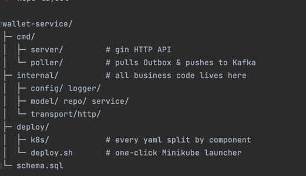

# crypto.com – Wallet Take-Home Exercise (Go + K8s)

---

⚡ **TL;DR**

```bash

# Full K8s (Minikube)
minikube start \
  --driver=docker \
  --kubernetes-version=v1.25.3 \
  --insecure-registry="registry.local:5000,host.docker.internal:5000"
  
  minikube ssh -- \
  "echo \"\$(ip route|awk '/default/ {print \$3}') registry.local\" \
    | sudo tee -a /etc/hosts"


kubectl -n ingress-nginx patch svc ingress-nginx-controller \
  --patch '{
    "spec": {
      "type": "LoadBalancer"
    }
  }'
./deploy/deploy.sh       # builds images, deploys Redis/Postgres/Kafka/Ingress/PVC

sudo minikube tunnel     # expose Ingress on localhost:80

```

---

## 🤔 Why this repo exists

Crypto.com requested a take home work for wallet service. We implemented a  “wallet backend that supports deposit / withdraw / transfer with an Outbox event stream.”
Rather than a one-file hack, this repo demonstrates a clean, production-style architecture while staying minimal:

* **Gin** for a lightweight HTTP API
* **GORM** for type-safe ORM + optimistic locking
* **Outbox + Poller** for reliable, at-least-once event delivery using only Postgres
* **Redis** for read caching
* **Minikube + Bash** script for 100% reproducible cluster deployment
* **ASCII & embedded images** in README — no PPT needed 😎

---

## 🧱 Repo layout

```
.
├── cmd/                  # binaries: server & poller
├── internal/
│   ├── config/           # YAML-based config loader
│   ├── model/            # GORM entity definitions
│   ├── repo/             # data access, outbox, cache
│   ├── service/          # business logic
│   └── transport/http/   # Gin handlers, middlewares
├── deploy/
│   ├── k8s/              # Kubernetes manifests
│   └── deploy.sh         # one-shot Minikube deploy script
├── hack/compose.yml      # Docker-Compose for local Postgres+Redis  
└── tests/                # unit & integration tests
```



---

## 📐 Architecture

```
Client ──HTTP──> wallet-server ──┐                    
                                │                    
                                ▼                    
                          Postgres (wallet + outbox)
                                │                    
                                │  Poll every 2s      
                                ▼                    
                        wallet-poller ──> Kafka        
```


1. **Single DB transaction** writes balance change + outbox record.
2. **wallet-poller** scans `processed=false` rows, publishes to Kafka, marks them processed.
3. **Crash-resilient** – unprocessed rows remain and are retried (at-least-once semantics).

---

## ☸️ Kubernetes Manifests Explained

All files live under `deploy/k8s/`. Below is a summary of each key YAML and its purpose:

| Path                              | Kind                  | Purpose & Key Fields                                                                                                                                                                                                                                                     |
| --------------------------------- | --------------------- | ------------------------------------------------------------------------------------------------------------------------------------------------------------------------------------------------------------------------------------------------------------------------ |
| **namespace.yaml**                | Namespace             | `name: wallet` – isolates all resources into the `wallet` namespace.                                                                                                                                                                                                     |
| **redis/redis-pvc.yaml**          | PersistentVolumeClaim | `accessModes: ReadWriteOnce`, `storage: 1Gi` – durable storage for Redis AOF.                                                                                                                                                                                            |
| **redis/redis-deploy.yaml**       | Deployment            | `replicas: 1`; `image: redis:7-alpine`; `args: ["redis-server","--appendonly","no"]`; mounts PVC `redis-pvc` at `/data`.                                                                                                                                                 |
| **redis/redis-svc.yaml**          | Service (ClusterIP)   | `port: 6379 → targetPort: 6379`; selector `app: redis` – internal DNS `redis.wallet.svc.cluster.local`.                                                                                                                                                                  |
| **postgres/postgres-pvc.yaml**    | PersistentVolumeClaim | `accessModes: ReadWriteOnce`, `storage: 5Gi` – durable Postgres data.                                                                                                                                                                                                    |
| **postgres/postgres-deploy.yaml** | Deployment            | `replicas: 1`; `image: postgres:15`; mounts PVC `postgres-pvc` at `/var/lib/postgresql/data` and ConfigMap `wallet-init-sql` at `/docker-entrypoint-initdb.d`; env from `wallet-db-secret` keys `POSTGRES_USER`, `POSTGRES_PASSWORD`, `POSTGRES_DB`.                     |
| **postgres/postgres-svc.yaml**    | Service (ClusterIP)   | `port: 5432 → targetPort: 5432`; selector `app: postgres`.                                                                                                                                                                                                               |
| **kafka/kafka-deploy.yaml**       | Deployment            | `replicas: 1`; `image: docker.io/bitnami/kafka:3.7.0`; env: `KAFKA_CFG_ZOOKEEPER_CONNECT=zookeeper:2181`, `KAFKA_CFG_LISTENERS=PLAINTEXT://0.0.0.0:9092`, `KAFKA_CFG_ADVERTISED_LISTENERS=PLAINTEXT://kafka:9092`, `ALLOW_PLAINTEXT_LISTENER=yes`; containerPort `9092`. |
| **kafka/kafka-svc.yaml**          | Service (ClusterIP)   | `port: 9092 → targetPort: 9092`; selector `app: kafka`.                                                                                                                                                                                                                  |
| **zookeeper/zk-deploy.yaml**      | Deployment            | `replicas: 1`; `image: zookeeper:3.7`; containerPort `2181`.                                                                                                                                                                                                             |
| **zookeeper/zk-svc.yaml**         | Service (ClusterIP)   | `port: 2181 → targetPort: 2181`; selector `app: zookeeper`.                                                                                                                                                                                                              |
| **wallet-config.yaml**            | ConfigMap             | key `config.yaml` containing:<br>`server.port: 8080`<br>`postgres.dsn: "host=postgres dbname=walletdb user=wallet sslmode=disable"`<br>`redis.addr: "redis:6379"` etc.                                                                                                   |
| **wallet-db-secret.yaml**         | Secret (Opaque)       | stringData keys `POSTGRES_USER`, `POSTGRES_DB`, `POSTGRES_PASSWORD` – injected as DB env vars.                                                                                                                                                                           |
| **wallet-init-sql**               | ConfigMap             | key `init.sql` defines tables `wallet`, `transaction`, `event_outbox` and index `idx_event_outbox_unprocessed`.                                                                                                                                                          |
| **wallet/poller-deploy.yaml**     | Deployment            | `replicas: 1`; `image: host.docker.internal:5000/wallet-poller:latest`; `envFrom` references `wallet-config` & `wallet-db-secret`; mounts `config.yaml` from that ConfigMap.                                                                                             |
| **wallet/server-deploy.yaml**     | Deployment            | `replicas: 1`; `image: host.docker.internal:5000/wallet-server:latest`; containerPort `8080`; `envFrom` references `wallet-config` & `wallet-db-secret`; mounts `config.yaml`.                                                                                           |
| **wallet/server-svc.yaml**        | Service (ClusterIP)   | `port: 80 → targetPort: 8080`; selector `app: wallet-server`.                                                                                                                                                                                                            |
| **ingress.yaml**                  | Ingress               | ingressClassName `nginx`; rule host `wallet.local`, path `/` → service `wallet-server:80`; annotation `ssl-redirect: "false"`.                                                                                                                                           |
> **Note:** Changing any `spec` field → `kubectl apply` triggers rolling update without manual restarts.

---


## 🏗️ Full Kubernetes deploy (Minikube)

# Full K8s (Minikube)
minikube start \
--driver=docker \
--kubernetes-version=v1.25.3 \
--insecure-registry="registry.local:5000,host.docker.internal:5000"

minikube ssh -- \
"echo \"\$(ip route|awk '/default/ {print \$3}') registry.local\" \
| sudo tee -a /etc/hosts"


kubectl -n ingress-nginx patch svc ingress-nginx-controller \
--patch '{
"spec": {
"type": "LoadBalancer"
}
}'
./deploy/deploy.sh       # builds images, deploys Redis/Postgres/Kafka/Ingress/PVC

sudo minikube tunnel     # expose Ingress on localhost:80

**Tear down**

   ```bash
   minikube delete && docker rm -f registry-local
   ```

---

## 🛠️ Dev cheatsheet

```bash
# Run unit & repo tests
go test ./... -race

# Lint
golangci-lint run

# Simulate 1 000 transfers @100 rps
hey -n 1000 -c 50 -m POST \
  -H 'Content-Type: application/json' \
  -d '{"to_id":2,"amount":"0.01","idempotency_key":"spam"}' \
  http://wallet.local/v1/wallets/1/transfer
```

---

## 🤯 FAQ (short)

| Question                       | Answer                                                                          |
| ------------------------------ | ------------------------------------------------------------------------------- |
| Why not use a migrations tool? | For a take-home, embedding SQL in a ConfigMap is acceptable; prod → goose/atlas |
| Exactly-once delivery?         | Would require PG logical replication + Kafka Tx or Debezium; out of scope       |
| Why single Kafka broker?       | Simpler on laptops; scale to 3 replicas via values-prod.yaml                    |
| TLS / Auth?                    | Intentionally omitted for brevity                                               |

---

## 📊 Test case walkthrough

1. **Deployment in Minikube + Ingress**
   

2. **Deposit for a given wallet**
   

3. **Idempotent deposit (same key)**
   

4. **Deposit with a different key**
   

5. **Check balance**
   

6. **Withdraw**
   

7. **Transfer to another wallet**
   

8. **Transaction history**
   

---

> **Note:** All manifests are vanilla Kubernetes YAML; you can easily convert to Helm/Helmfile or GitOps later.

Enjoy the code, and let me know if you’d like any further clarifications or a live demo!

— **Richard Liu**
