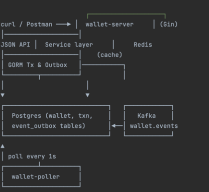
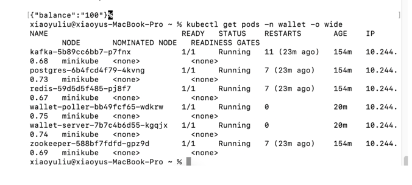
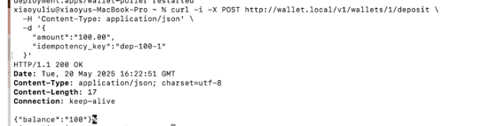
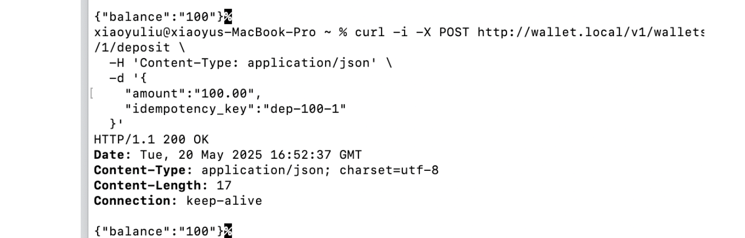
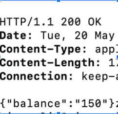
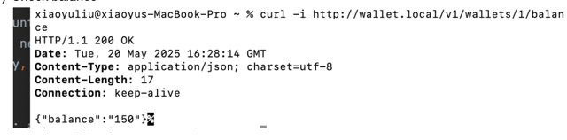
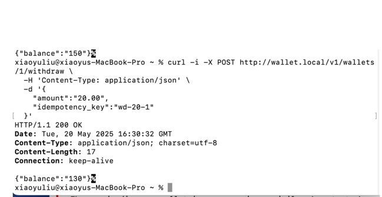
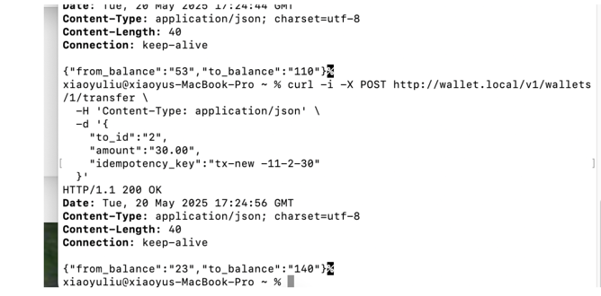
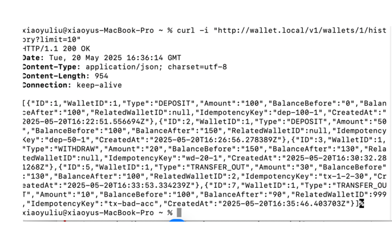

crypto.com – Wallet Take-Home Exercise (Go + K8s)

⚡ TL;DR

Clone → make run-local to spin up Postgres + Redis in Docker and start the server.
./deploy/deploy.sh to launch the whole thing in Minikube (Kafka, PVC, Ingress etc.).

⸻

🤔 Why this repo exists

Crypto.com asked for a “wallet backend that supports deposit / withdraw / transfer with an Outbox event stream”.
Instead of hacking everything in one main.go, the code here shows one possible way to keep things clean without being enterprise-bloated.
•	Gin – tiny HTTP layer
•	GORM – less SQL hand-writing
•	Outbox + Poller – reliable events with only Postgres
•	Minikube script – 100 % reproducible on any laptop
•	ASCII diagrams – because PowerPoint is overrated 😎

⸻

🧱 Repo layout

wallet-service/
├─ cmd/
│  ├─ server/         # gin HTTP API
│  └─ poller/         # pulls Outbox & pushes to Kafka
├─ internal/          # all business code lives here
│  ├─ config/ logger/
│  ├─ model/ repo/ service/
│  └─ transport/http/
├─ deploy/
│  ├─ k8s/            # every yaml split by component
│  └─ deploy.sh       # one-click Minikube launcher
└─ schema.sql

⸻

📐 Architecture 

	•	Single DB transaction updates balance and inserts an Outbox row
	•	wallet-poller keeps shooting unprocessed rows to Kafka; when ACKed it flips processed=true
	•	If Poller crashes → record stays unprocessed → retried next loop (at-least-once)

⸻

🚀 Run it locally (no K8s)

# 0. clone repo
git clone 
cd wallet-service

# 1. spin up minimal stack (Postgres + Redis)
make run-local          # == docker compose -f hack/compose.yml up -d
export POSTGRES_PASSWORD=walletpass # env that config loader uses
go run ./cmd/server     # Gin listening on :8080

# 2. smoke test
curl -X POST localhost:8080/v1/wallets/1/deposit \
-H 'Content-Type: application/json' \
-d '{"amount":"100","idempotency_key":"init"}'

curl localhost:8080/v1/wallets/1/balance   # {"balance":"100"}

Note: Poller is optional in local mode (no Kafka). Run go run ./cmd/poller if you have Kafka too.

⸻

☸️ Full Kubernetes deploy (Minikube)
1.	Prereqs
•	Docker, kubectl, minikube ≥ 1.30
•	bash, sed (for the script)
2.	One-liner

chmod +x deploy/deploy.sh
./deploy/deploy.sh

	3.	What the script does
	•	boots Minikube with an insecure local registry registry.local:5000
	•	builds / pushes wallet-server & wallet-poller images
	•	applies every yaml under deploy/k8s/
	•	waits for redis, postgres, kafka, wallet-* to become Ready
	•	adds wallet.local into /etc/hosts pointing to the Minikube IP
	•	prints “curl http://wallet.local/…” for you
	4.	Tear down

minikube delete && docker rm -f registry-local

⸻

🛣️ Important YAMLs explained (super short)

path	why it exists
wallet-init-sql-configmap.yaml	embeds schema.sql; Postgres container auto-executes
postgres-pvc.yaml / redis-pvc.yaml	keep data if Pod dies
server-deploy.yaml	envFrom ConfigMap + Secret  image = registry.local:5000/...
ingress.yaml	expose as http://wallet.local via Nginx addon

All manifests are vanilla; switch to Helm/Helmfile later if you prefer.

⸻

🛠️ Dev cheatsheet

# run all unit tests
go test ./... -race

# hit the transfer API 1k times (rate-limited 100 rps)
hey -n 1000 -c 50 -m POST \
-H "Content-Type: application/json" \
-d '{"to_id":"2","amount":"0.01","idempotency_key":"spam"}' \
http://wallet.local/v1/wallets/1/transfer

⸻

🤯 FAQ (short edition)

Q	A
Why not migrations tool?	for a take-home, embedding sql in ConfigMap is OK; prod → goose / atlas
What about exactly-once events?	need PG logical replication + Kafka Tx or Debezium; out of scope here
Why single Kafka broker?	easier on laptops; scale to 3 in values-prod.yaml
TLS / Auth?	left out intentionally for brevity

Test case
Deployment using minikube + ingress

Deposit for a given wallet using the idempotency key

Deposit for a given wallet using the duplicate  idempotency key
The result should not change

Deposit using a different key

Check balance

Withdraw

transfer for a given wallet to another wallet

Check for the transaction history of a wallet

